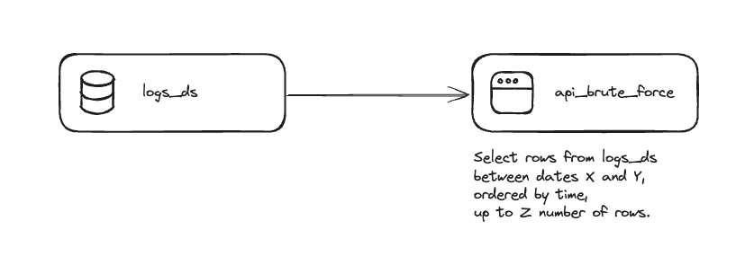
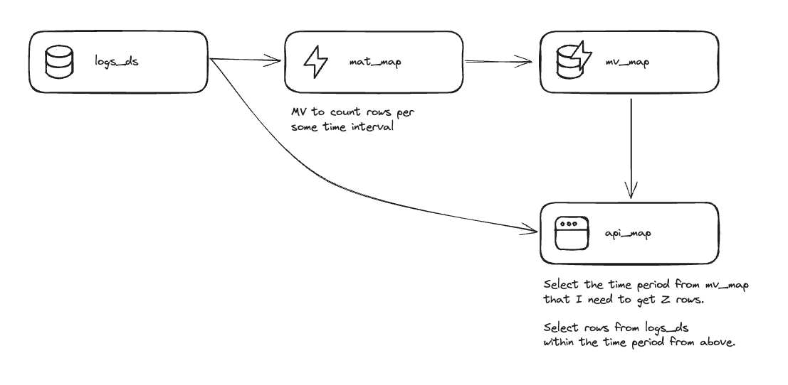

# Use Case Demo: Logs Explorer

A common issue when retrieving raw data is returning only X amount of rows/data according to some constraints. This request usually has a time filter defined by the end user, like "give me all of the data between dates X through Y". Generally, there is some bottleneck in the request. Some common examples of such bottlenecks:

1. A user wants to retrieve all logs between two dates. They need to manage the memory usage in the client, so they want to paginate results and retrieve them gradually.
2. A user wants to export data between two dates. They need to limit the amount of data/rows per file, so they need to know the maximum period length that they can allow in a single export operation.

This can be done with "brute force", using a query like `SELECT ... FROM logs_table ORDER BY timestamp LIMIT n_max_rows`. However, this is not always practical, as you will need to read every row due to the `ORDER BY timestamp` part. As data scales, this query can get expensive in terms of cost and performance.

This repository contains code for an optimized version of this use case using a "map" approach.

## Optimize with "map" approach

This is an example of a logs explorer app, in which users can view and search through a paginated list of logs.

The "brute force" query is like "give me all rows between dates X and Y, ordered by time, up to Z number of rows."

Instead, we can flip this to "what is the time period, starting at X and up to Y, that I need to query in order to get Z number of rows?" This query can be executed much faster, and it will give us a "map" of where the data is. We can use this "map" to reformulate the original query in a way that does not involve reading all of the data.

## Deploy it yourself

[Read the guide](https://www.tinybird.co/docs/guides/this-is-the-guide-slug) to deploy this demo application yourself.

## License

This code is available under the MIT license. See the [LICENSE](./LICENSE.txt) file for more details.

## Need help?

- [Tinybird Slack Community](https://www.tinybird.co/community)
- [Tinybird Docs](https://www.tinybird.co/docs)

## Authors

- [Paco González López](https://github.com/FGonzalezLopez)
- [David Margulies](https://github.com/davidnmargulies)
